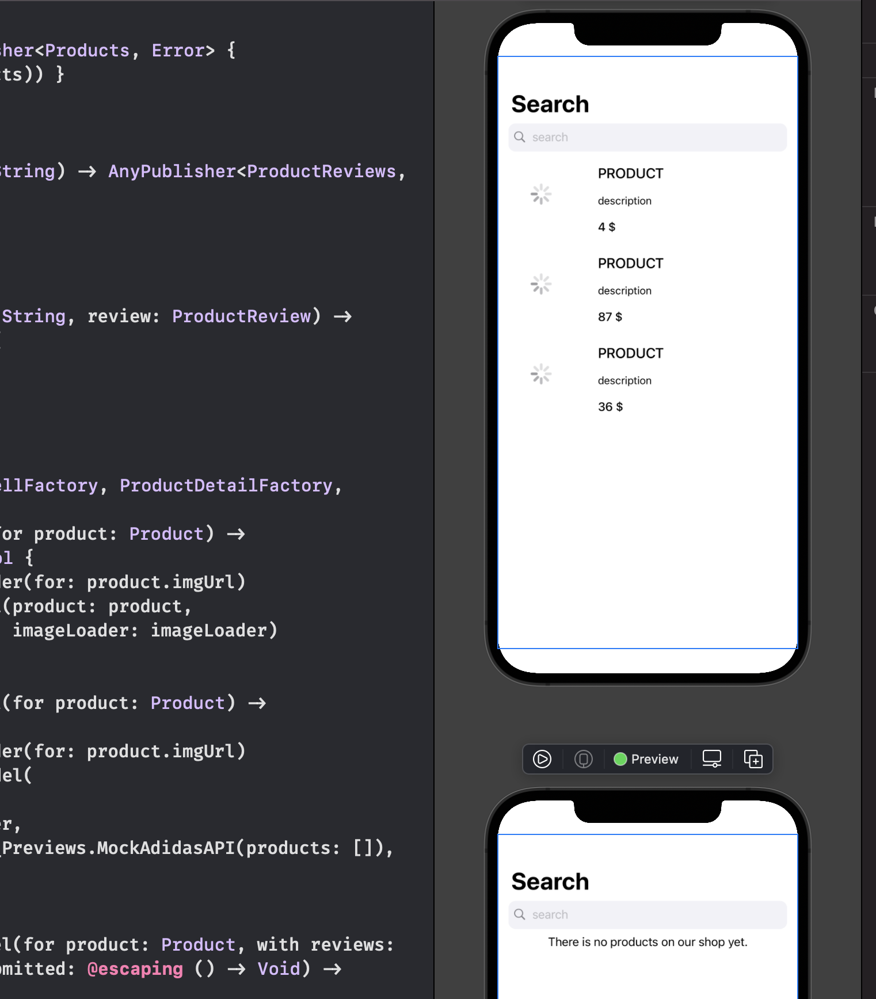
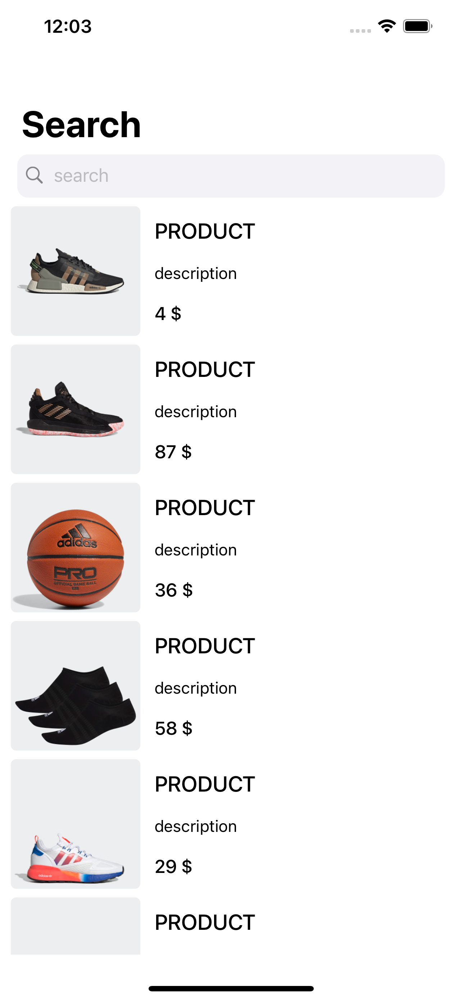
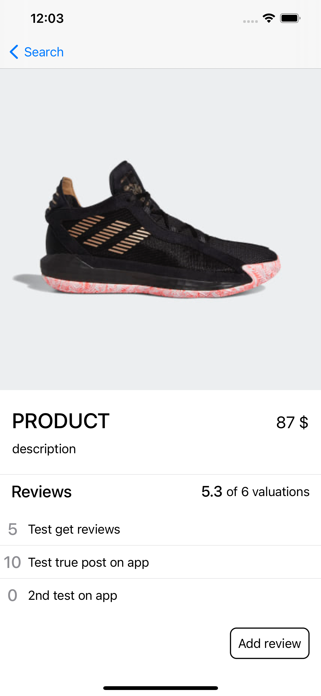
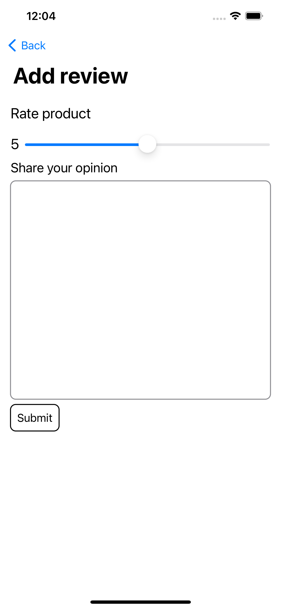

# AdidasChallenge

# Project struture

AFAIK, Adidas Confirmed App is a brand new app, targetting a specific set of clients, which have the lastest devices models. For those reasons, I believe that the minimum OS version supported should be high enough to be able to support SwiftUI + Combine.

I risked designing this project with those core tecnologies, which were mostly unknown to me until now. With that in mind, this project follows the MVVM architecture, splitting view and logic by layer as much as possible.

> My short summary review after doing this project is that although SwiftUI is already being set into production, for Apps with a strong design specifications it still has some gaps. An example of it that I found is on List's, which had some UI bugs and I wasn't able to find workable solution. Came to a conclusion that is a iOS14 bug (already fixed on iOS15 apparently). The work around fortunately produce good and viable results, replacing List for a ScrollView with LazyVStack.

One thing you will find is that every view uses the Preview feature of SwiftUI, which allows us to code and see in real time the changes. Another positive point I found of this feature is that enforce developeres to make dependencies abstracted by interfaces, because we need to mock value to make Previews work good.

The only exepection I couldn't work around was the direct ViewModel for each View. Unfortunately the @ObservableObject property wrapper makes a class have an associateType, which stop us from using interface eraser.

I didn't use any third party framework. So the project should run right away.

## Organization

### Scenes
THe project has 3 main schenes: ProductListView, ProductDetailsView, and AddReviewView.
<table style="width:100%">
    <th><a href="AdidasChallenge/Scenes/ProductListView">ProductListView</a></th>
    <th><a href="AdidasChallenge/Scenes/ProductDetailsView">ProductDetailsView</a></th>
    <th><a href="AdidasChallenge/Scenes/AddReviewView">AddReviewView</a></th>
  </tr>
  <tr>
    <td></td>
    <td></td>
    <td></td>
  </tr>
</table>

### Factories
Each scene has its own components (subviews) and services dependencies. To help managing this creation complexity everything is "under" a factory responsible to hold or create services dependencies. This factory uses interface segregation to facilitate test layer. 

### Services
On Services folder you will find services that provide background work and make things transparent, keeping our logic layer clean.

- The network service provides an easy API to make requests for getting (and post) the producs and reviews.
- The image loader is a facilitator for getting images, and providing a clear state on the progression of it. I also added some customization for getting the images  with the correct size.
- The image cache is just a simple runtime cache which is used by image loader.

## Components

Most components are subviews which could be reused. They have always a ViewModel as logic layer. You might find some that seems they don't have it's own VM. Those are just SwiftUI view extractions to make others views easier to read and follow the code.

### AsyncImage

This is a praticular complex view which manages the state of a image being loaded. AsyncImage is natively for iOS15+ which is still in beta. The one you find here is an inspired class on that implementation.

# Weak points and next steps

Due to time constraints, there was a bunch of stuff that I'm not 100% happy with the resut and recognize that should be improved.

## Localization

I did no localization for this project, with no excuse other than time. I'm confortable with localization and have setted the baselines for the project I currently work.

## Reachability

The app is not thought to work without connection. I didn't settup any persistent storage system so there isn't really the opportunity to work without network. For this reason I would add a generic fullscreen view that would override any other view asking the user to reconnect.

## Handling network errors

I have included a very basic and harsh error handling with an alert allowing user to retry. This is ofc a very bad experience for the user. I would improve it, removing the alert, and replacing the views that required those BE models with a small text message and a retry button. Making the experience for the user less scary.

## Logging

Logging is not something I know a lot tbh. I search for some framework utilities that would help logging errors and crashes but was too much for the number of calls I would use. For that reason, I used the native os_log for network errors and app important failures, like "impossible" guard missing unwraps e.g. I didn't set this for 100% of the app, but I think it can show how I would handle it for this project.

## Skeleton views

For most cases on App requesting information from the BE I made use of a ProgressiveView to mark the loading state. Which then is replaced by the information received. Ideally this would be a set of skeleton views, customized for each view style.

## Image cache

I added a very simple runtime cache system to improve the performance of the App and spare unnecessary heavy calls. It would be even better if I added a persistent storage on top of this system. I would use the file system to store the image files.

## Test coverage

I did not check the test coverage but I know that it must not be high. Although I didn't test every single class, I pick some that would show I'm confortable doing unit tests and working with mocks. Also I think most of the code is testable and I strive to keep logic on the logic layer everytime. I'm also used to snapshot tests. On the other hand, I'm not particular knowledge on UI tests.

